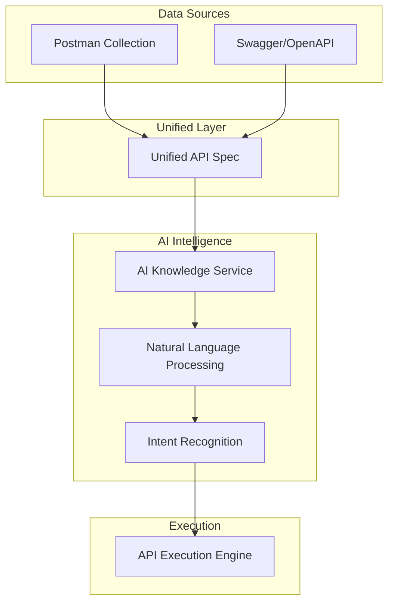

# 🤖 AI Knowledge Architecture

## Overview

The **AI Knowledge Architecture** is the core intelligence layer that transforms raw API documentation into AI-understandable knowledge, enabling natural language queries and intelligent API execution.

## 🏗️ Architecture Flow



## 🎯 Design Philosophy

### **Best of Both Worlds Integration**

| Source | Provides | AI Benefit |
|--------|----------|------------|
| **Postman** | ✅ Real authentication<br>✅ Working examples<br>✅ Environment variables<br>✅ Custom headers | **Real-world context**<br>Actual tested requests<br>Environment-aware execution |
| **Swagger/OpenAPI** | ✅ Parameter schemas<br>✅ Response structures<br>✅ Validation rules<br>✅ Documentation | **Formal structure**<br>Type safety<br>Comprehensive validation |

### **Unified API Specification**

The architecture creates a **single source of truth** that combines:

- **Schema Definitions** (from OpenAPI) + **Real Examples** (from Postman)
- **Validation Rules** (from OpenAPI) + **Working Authentication** (from Postman)
- **Formal Documentation** (from OpenAPI) + **Environment Context** (from Postman)

## 🧠 AI Knowledge Components

### 1. **Unified API Parser**
```java
PostmanCollection + OpenAPI/Swagger → UnifiedApiSpec
```
- Merges both data sources intelligently
- Resolves conflicts with configurable precedence
- Creates comprehensive API knowledge base

### 2. **Natural Language Processor**
```java
"Get user profile for john@example.com" → Intent + Parameters + Endpoint
```
- Understands user queries in natural language
- Maps intents to specific API operations
- Extracts parameters from conversational input

### 3. **Context-Aware Execution**
```java
Intent + UnifiedSpec + Environment → Authenticated API Call
```
- Uses real authentication from Postman
- Applies environment-specific configurations
- Handles complex parameter mapping

## 🔄 Data Flow Architecture

### **Phase 1: Data Ingestion**
```
┌─────────────────┐    ┌──────────────────┐
│ Postman         │    │ OpenAPI/Swagger  │
│ Collection      │    │ Specification    │
│                 │    │                  │
│ • Auth configs  │    │ • Schemas        │
│ • Examples      │    │ • Validation     │
│ • Environments  │    │ • Documentation  │
└─────────────────┘    └──────────────────┘
         │                       │
         └───────────┬───────────┘
                     ▼
         ┌─────────────────────────┐
         │   Unified API Spec      │
         │                         │
         │ • Complete schemas      │
         │ • Real authentication   │
         │ • Working examples      │
         │ • Environment context   │
         └─────────────────────────┘
```

### **Phase 2: AI Knowledge Processing**
```
┌─────────────────────────┐
│   Unified API Spec      │
└─────────┬───────────────┘
          ▼
┌─────────────────────────┐
│  AI Knowledge Service   │
│                         │
│ • Schema analysis       │
│ • Intent mapping        │
│ • Parameter extraction  │
│ • Validation rules      │
└─────────┬───────────────┘
          ▼
┌─────────────────────────┐
│   AI-Optimized Format   │
│                         │
│ • Natural language tags │
│ • Intent categories     │
│ • Parameter hints       │
│ • Execution context     │
└─────────────────────────┘
```

### **Phase 3: Query Processing & Execution**
```
┌─────────────────────────┐
│   User Natural Query    │
│ "Get profile for john"  │
└─────────┬───────────────┘
          ▼
┌─────────────────────────┐
│   Intent Recognition    │
│                         │
│ • Query analysis        │
│ • Parameter extraction  │
│ • Endpoint matching     │
└─────────┬───────────────┘
          ▼
┌─────────────────────────┐
│   API Execution Engine  │
│                         │
│ • Authentication        │
│ • Parameter validation  │
│ • Request building      │
│ • Response processing   │
└─────────────────────────┘
```

## 🎛️ Key Architecture Benefits

### **1. Intelligent Merging**
- **Conflict Resolution**: Configurable precedence rules
- **Gap Filling**: Missing data filled from available sources
- **Validation**: Cross-validation between sources

### **2. AI-Optimized Structure**
- **Natural Language Tags**: Keywords for intent matching
- **Complexity Scoring**: Helps AI choose appropriate endpoints
- **Dependency Mapping**: Understands endpoint relationships

### **3. Context Awareness**
- **Environment Variables**: Dev/staging/prod awareness
- **Authentication Context**: Real auth configurations
- **Example-Driven**: Uses actual working examples

### **4. Extensible Design**
- **Plugin Architecture**: Easy to add new data sources
- **Custom Processors**: Extensible AI processing pipeline
- **Configurable Merging**: Flexible merge strategies

## 🔧 Configuration & Customization

### **Merge Options**
```java
MergeOptions.builder()
    .authPrecedence(POSTMAN)           // Prefer Postman auth
    .schemaPrecedence(OPENAPI)         // Prefer OpenAPI schemas
    .examplePrecedence(POSTMAN)        // Prefer Postman examples
    .conflictResolution(MERGE_BOTH)    // How to handle conflicts
    .build();
```

### **AI Processing Hints**
```java
EndpointMetadata.builder()
    .category("USER_MANAGEMENT")       // Functional category
    .keywords(List.of("user", "profile", "account"))
    .intent("Retrieve user information")
    .complexity(2)                     // 1-5 complexity score
    .dependencies(List.of("auth"))     // Required prerequisites
    .build();
```

## 🚀 Future Enhancements

### **Planned Features**
- **GraphQL Integration**: Support for GraphQL schemas
- **gRPC Support**: Protocol buffer definitions
- **Real-time Updates**: Live API specification updates
- **ML-Based Intent Recognition**: Advanced NLP capabilities
- **Multi-API Orchestration**: Complex workflow execution

### **AI Capabilities Roadmap**
- **Conversation Memory**: Context-aware multi-turn conversations
- **Error Recovery**: Intelligent error handling and retry logic
- **Performance Optimization**: Smart caching and request optimization
- **Security Analysis**: Automatic security best practice validation

---

This architecture enables developers to interact with APIs using natural language while maintaining the precision and reliability of formal API specifications. The unified approach ensures that AI has access to both the theoretical structure (OpenAPI) and practical reality (Postman) of API usage.
